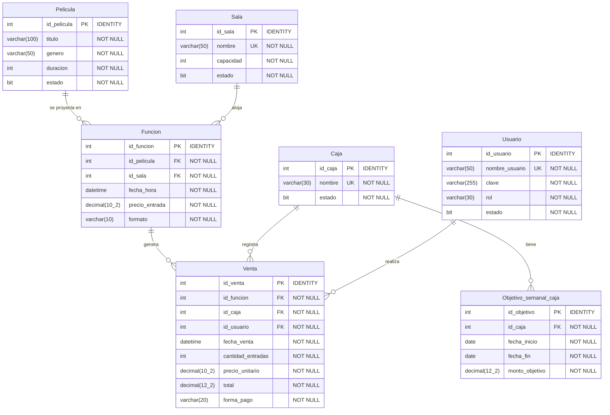

# Diagrama de persistencia (versión corregida)

```mermaid
erDiagram
    Pelicula ||--o{ Funcion : "se proyecta en"
    Sala     ||--o{ Funcion : "aloja"
    Funcion  ||--o{ Venta : "genera"
    Caja     ||--o{ Venta : "registra"
    Usuario  ||--o{ Venta : "realiza"
    Caja     ||--o{ Objetivo_semanal_caja : "tiene"

    Usuario {
        int id_usuario PK "IDENTITY"
        varchar(50) nombre_usuario UK "NOT NULL"
        varchar(255) clave "NOT NULL"
        varchar(30) rol "NOT NULL"
        bit estado "NOT NULL"
    }

    Pelicula {
        int id_pelicula PK "IDENTITY"
        varchar(100) titulo "NOT NULL"
        varchar(50) genero "NOT NULL"
        int duracion "NOT NULL"
        bit estado "NOT NULL"
    }

    Sala {
        int id_sala PK "IDENTITY"
        varchar(50) nombre UK "NOT NULL"
        int capacidad "NOT NULL"
        bit estado "NOT NULL"
    }

    Funcion {
        int id_funcion PK "IDENTITY"
        int id_pelicula FK "NOT NULL"
        int id_sala FK "NOT NULL"
        datetime fecha_hora "NOT NULL"
        decimal(10_2) precio_entrada "NOT NULL"
        varchar(10) formato "NOT NULL"
    }

    Caja {
        int id_caja PK "IDENTITY"
        varchar(30) nombre UK "NOT NULL"
        bit estado "NOT NULL"
    }

    Venta {
        int id_venta PK "IDENTITY"
        int id_funcion FK "NOT NULL"
        int id_caja FK "NOT NULL"
        int id_usuario FK "NOT NULL"
        datetime fecha_venta "NOT NULL"
        int cantidad_entradas "NOT NULL"
        decimal(10_2) precio_unitario "NOT NULL"
        decimal(12_2) total "NOT NULL"
        varchar(20) forma_pago "NOT NULL"
    }

    Objetivo_semanal_caja {
        int id_objetivo PK "IDENTITY"
        int id_caja FK "NOT NULL"
        date fecha_inicio "NOT NULL"
        date fecha_fin "NOT NULL"
        decimal(12_2) monto_objetivo "NOT NULL"
    }
```

El diagrama editable es `Diagram de persistencia tablero de cine.drawio` (en la raiz del proyecto) y ya incluye todas estas correcciones.
